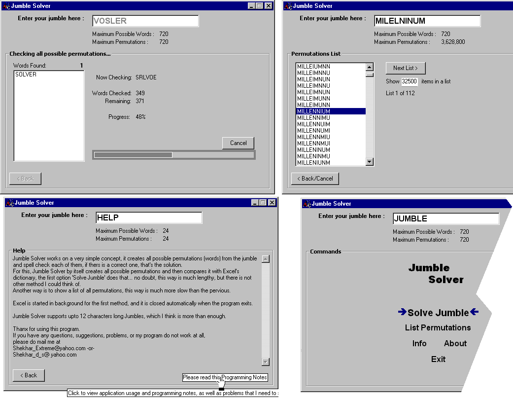

## Jumble Solver

### Description

A utility to solve JUMBLED puzzles. It creates all possible permutations (words) and compares them with Excel 2000's dictionary, and finds the correct word. Features: A permutations list generator, uses Office programs directly from VB, a different kind of menu, etc. << PLEASE VOTE >>
 
### More Info
 
Requires the user to enter a jumbled word.

It can directly solve the jumble, or can show a list of all possible permutations.

It requires Office-Excel 2000 installed.

             |
---                |---
**Submitted On**   |2001-12-04 12:49:40
**By**             |[Shekhar Somani](https://github.com/Planet-Source-Code/PSCIndex/blob/master/ByAuthor/shekhar-somani.md)
**Level**          |Intermediate
**User Rating**    |5.0 (20 globes from 4 users)
**Compatibility**  |VB 5\.0, VB 6\.0, VBA MS Excel
**Category**       |[Complete Applications](https://github.com/Planet-Source-Code/PSCIndex/blob/master/ByCategory/complete-applications__1-27.md)
**World**          |[Visual Basic](https://github.com/Planet-Source-Code/PSCIndex/blob/master/ByWorld/visual-basic.md)
**Archive File**   |[Jumble\_Sol393151242001\.zip](https://github.com/Planet-Source-Code/shekhar-somani-jumble-solver__1-29458/archive/master.zip)

